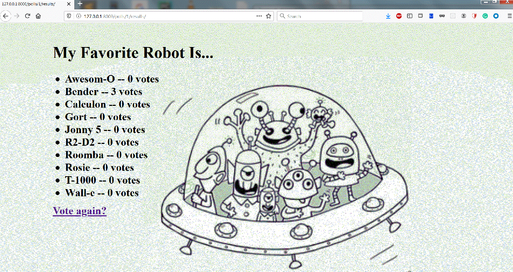
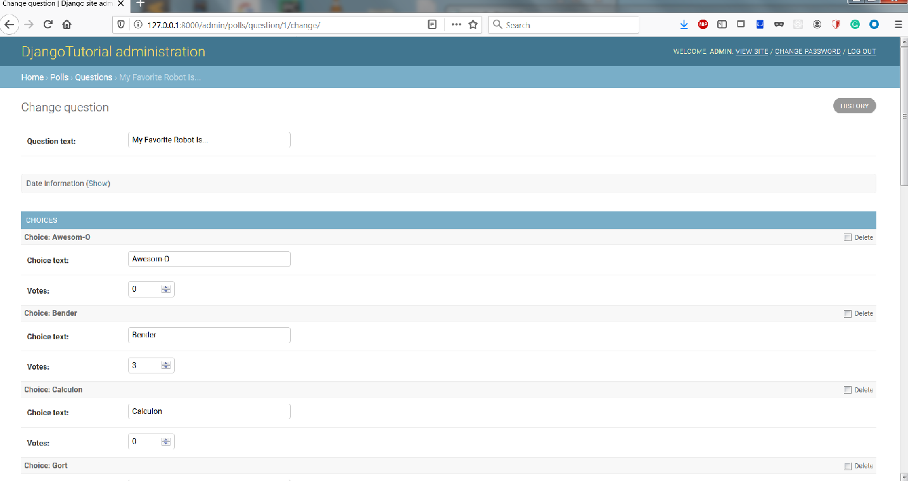

# DjangoTutorial
Django polling website tutorial built with python

## Synopsis

Name:  Django Tutorial - Robot Poll

This is Robot Polling application built with the Django tutorial.

The Django tutorial can be accessed here <https://docs.djangoproject.com/en/3.0/>

## Code Description

This website has user modules (3 templates: index, detail and result pages) and an administrative module.

Below are screen shots with a radio button choice-detail screen, the polling-result screen and administrative module:

<kbd>|</kbd><kbd></kbd>

The Administrative module alows for login and password setting along with changing polling question and choices.

<kbd></kbd>

  

## Motivation

Experiment with developing a website using Django - python.

## Installation

Project can be downloaded from GitHub.  
https://github.com/hillc255/DjangoTutorial

## API Reference

## Tests

Added tests.py file has tests for 
1.  Creation of questions
2.  No questions presentisplays message
3.  Checking the date/time questions were created

